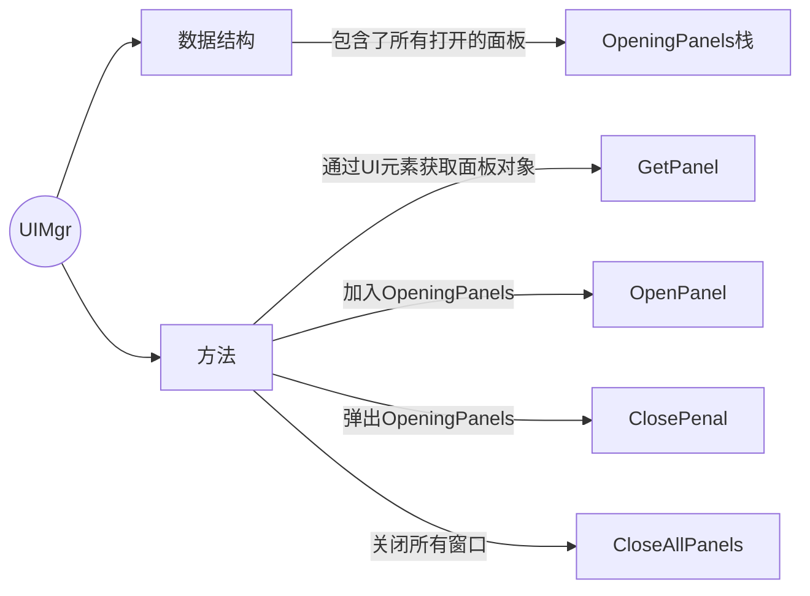
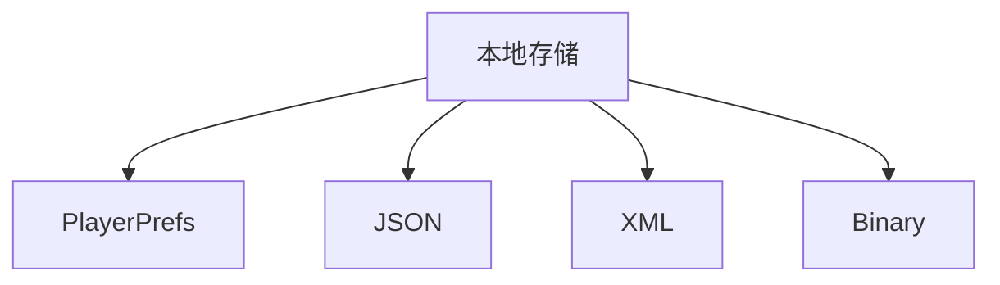
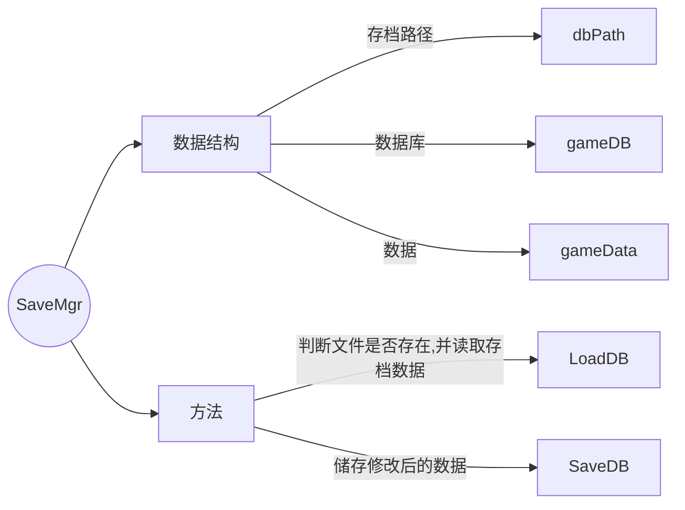

# Jam通用游戏框架 / GeneralJamFramework

> 注意事项：本项目使用的Unity版本为2021.3.26f1c1
拒绝白嫖，自己实现才能掌握口牙！

我准备参加2024年的GGJ，因为开发时间非常有限，所以一些通用的基础代码必须预先完成。


作为一个常规的game jam性质比赛小游戏，通常由以下几个大模块组成：

- **游戏标题**，其中包含了基本的开始游戏、设置、退出游戏和教程（部分模块为可选）
  - **层级UI**系统
  - **本地存储**系统
  - **音频音效**系统
- **关卡选择（可选）**，用户可以选择进入想要体验的关卡，也可以按游戏设计的流程走。对小体量的jam来说并不是必须的
  - **本地存储**系统
  - **场景加载**系统（**可选**，因为小体量的缘故加载几乎不需要消耗什么时间）
- **主游戏界面**
  - **层级UI**系统
  - **配置表**，主要用于快速调试和赋值，方便策划测试
  - **对象池**
- **游戏教学**
  - 如果时间不够，这部分可能更多的是一张或几张图片一笔带过。
  - **对话**/**事件**系统

从优先级进行排序，则是：

**层级UI** > **本地存储** > **配置表** > **音频音效** > **事件对话** >> **场景加载**。

本文将从这几个通用模块出发设计jam游戏框架。

# 多层嵌套的层级UI系统 / UIMgr

多层嵌套的层级UI系统指的是用户通过UI上的按钮等元素打开一个面板后，可以通过该面板上的UI元素打开新的面板并以此类推。比如说玩家点击设置按钮弹出设置面板，点击设置面板中的用户设置弹出新的面板...关闭时再点击多个返回直到完全关闭所有打开的UI。这个过程采用的数据结构是栈，因为符合LIFO。

UIMgr主要由以下结构组成:



我不推荐只显示OpeningPanels顶上的界面，因为弹出需要玩家确认的面板时下方的面板消失带来的视觉效果不太好。


我们当然可以让OpeningPanels栈中的所有面板都显示来维持效果，但由于Unity UI的自动排序，需要在面板上添加**Canvas组件**并开启**override sorting**以调整显示次序。同时不要忘记往面板上添加**UI Raycaster组件**，这样玩家才能与面板上的元素进行交互。

# 基于JSON的本地存储

常见的本地存储方式有以下几种，Unity自带了它们的解析系统，如`JsonUtility`、`XDocument`和`BinaryReader`。当然，也可以用其他类型的文件进行存储，在<a href="https://docs.unity3d.com/Manual/class-TextAsset.html">官方文档</a>中支持读取`.txt`、`.html`、`.htm`、`.xml`、`.bytes`、`.json`、`.csv`、`.yaml`、`.fnt`、`.md`的文本内容。


其中，
- `PlayerPrefs`：Unity自带的数据存储方式
  - 优点：使用简单，无需额外的库或工具。
  - 缺点：存储的数据类型有限（整数、浮点数、字符串、布尔值），存储的数据容易被用户修改，安全性较低。

- `JSON`：JSON是一种轻量级的数据交换格式，易于人阅读和编写，同时也易于机器解析和生成。
  - 优点：数据结构清晰，易于理解和操作，可以存储复杂的数据类型。
  - 缺点：存储的数据量较大时，解析和生成JSON数据需要一定的计算资源，对性能有一定影响。

- `XML`：XML是一种可扩展标记语言，可以用来存储和传输数据。
  - 优点:数据结构清晰，易于理解和操作，可以存储复杂的数据类型。
  - 缺点:存储的数据量较大时，解析和生成XML数据需要一定的计算资源，对性能有一定影响。

- `Binary`：二进制存储是一种直接将数据以二进制形式存储的方式。
  - 优点：存储的数据量小，读写速度快，对性能影响小。
  - 缺点：数据不易于理解和操作，需要额外的工具进行查看和编辑。

由于jam体量的游戏通常不会涉及到过量文本（真的有人会在jam做galgame吗），因此 PlayerPrefs/JSON/XML 都是比较适合的方式。我个人更喜欢用 JSON，因为它看起来更简洁和顺眼，支持数组并且 JSON 比 XML 占用的带宽更少。

> 这并不是说 PlayerPrefs 就是完全没用的，它的读写速度很快，在大型项目中我们可以用它存储首选项相关的设置，例如:
>- 音频设置：包括音乐音量、音效音量、语音音量等。
>- 显示设置：包括分辨率、窗口模式（全屏或窗口化）、图像质量（低、中、高）、特效设置等。
>- 控制设置：包括键盘布局、鼠标灵敏度、控制器设置等。
>- 游戏设置：包括难度级别、自动保存频率、字幕开关、语言选择等。
>- 网络设置：包括联机模式、服务器选择、网络优化等。
>- 隐私设置：包括数据共享、在线状态、好友列表等。

而通常在jam类型的小游戏中，我们只会涉及到这几种数据的存储：
- 游戏进度（影响到“加载游戏”功能是否可用，对只有一关的游戏则没有影响）
- 游戏得分/最高分
- 游戏设置
  - 音频设置数据

按照上面的需求，我们可以得到以下对象：

```JSON
"gameData": {
      "progress": 0,
      "maxScore": 0,
      "bkMusic": 1,
      "soundMusic": 1
  }
```

读写文件的部分可以借助 System.IO 下的 ReadAllText / WriteAllText方法，再借助 JsonUtility 类完成序列化的操作。需要注意的是用于序列化的类需要打上 `[System.Serializable]` 标签

以下为本地存档的基本结构：



# 基于EPPlus+Excel的动态配置表
配置表极大程度上方便了策划与程序之间的数据交流，可以通过excel将数据直接导入游戏对象上进行调试。


# 全局音频音效管理器
全局的音频管理器只负责两件事：


# 结合事件的对话系统
里氏替换原则：用空接口，然后让子类继承空接口，再统一装到容器里。


# 参考资料
利用JsonUtility库在Unity中读写游戏数据：https://videlais.com/2021/02/25/using-jsonutility-in-unity-to-save-and-load-game-data/
JSON vs XML for Unity C#：https://discussions.unity.com/t/json-vs-xml-for-unity-c/48285
How do I play multiple Audio Sources from one GameObject?（这篇文章其实讲的是在一个audioSource里放多个audioClip）：https://support.unity.com/hc/en-us/articles/206116386-How-do-I-play-multiple-Audio-Sources-from-one-GameObject 

