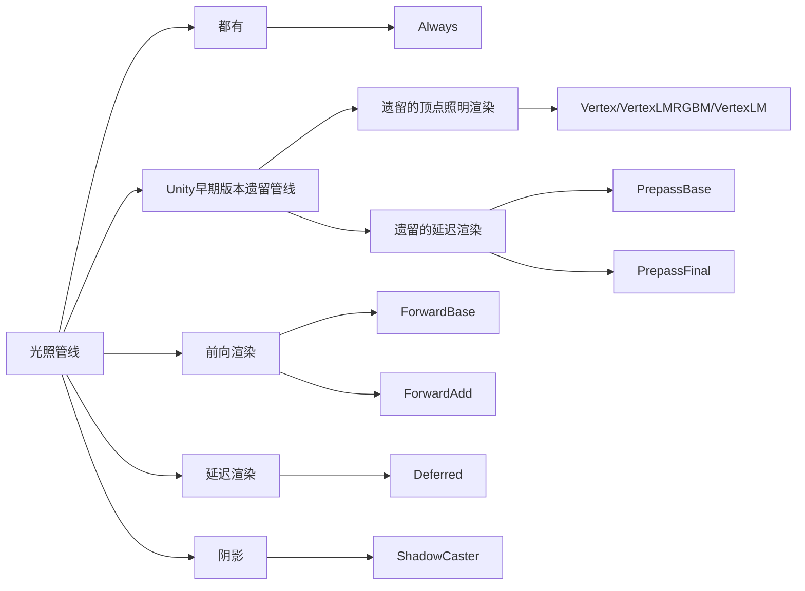
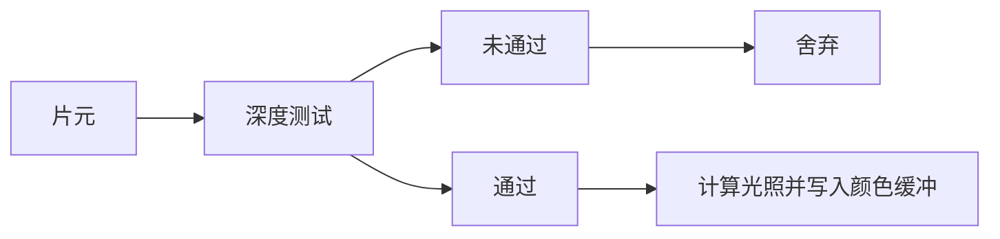

# §4-2：光照管线

# Forward光照管线
一般，我们在写Shaderlab的时候会在Pass中设置这个Pass所使用的光照管线，这样才能对光照做出正确的反应。我们声明光照管线是在Pass的Tags里，如：
```ShaderLab
Tags{ "LightMode" = "ForwardBase" }
```
在这里，我们把光照管线设置成了**前向渲染**。

> **LightMode标签**
LightMode标签声明了Pass使用那种光照管线进行渲染。根据光照管线的不同，有以下几种标签：
>- Always（不管使用哪种光照管线都会被渲染，但是不计算光照）
>- ForwardBase（计算环境光、最重要的平行光、逐顶点/SH光源和光照贴图）
>- ForwardAdd（计算其他光源、逐像素，一个Pass对应一个光源）
>- Deferred（计算G缓冲）
>- ShadowCaster（把深度信息渲染到阴影映射纹理（ShadowMap）中或深度纹理中）
>- Vertex、VertexLMRGBM、VertexLM（遗留的顶点光照）
>- PrepassBase（计算法线和高光反射的指数部分）
>- PrepassFinal（合并纹理、光照和自发光颜色得到最终的颜色）



## 原理
在前向渲染中最重要的两个缓冲是颜色缓冲和深度缓冲。当一个片元没有通过深度测试它就会被舍弃，如果通过之后就会在Pass中进行计算，然后将计算得出的光的颜色写进颜色缓冲区（我认为是叠加混合）。
对于每盏需要逐像素计算（Important）的灯都要重复一遍这个操作，最后得到多光源下的物体的最终颜色。但由于计算消耗过大的原因，引擎会限制最大Important数。

### 前向渲染的两种Pass
前向渲染有三种处理光照的方式，即：逐顶点（普通光源）、逐像素（最亮的平行光和渲染模式标注了Important的光）和球谐函数（SH）处理。
当光源的渲染模式设置为自动时，Unity会自动根据光源的远近、强弱等因素进行排序，设置逐像素或逐顶点的渲染光源。
逐像素渲染的光和Quality Setting中逐像素光源数量有关，而最多有4个光源按逐顶点的方式渲染，剩下的按SH方式进行渲染。渲染在Pass中进行。
<center></center>

#### Base Pass
```ShaderLab
Tags{ "LightMode"="ForwardBase" }
#pragma multi_compile_fwdbase
```
可以实现光照贴图、环境光、自发光和阴影（平行光的阴影）。
**仅执行一次，除非有多个Base Pass**，负责计算逐像素的平行光和所有逐顶点和SH光照。之所以放在base中是因为我们不希望多次叠加混合计算环境光和自发光，不然会变成超级炫光舞法天女。

#### Additional Pass
```ShaderLab
Tags{ "LightMode"="ForwardAdd" }
#pragma multi_compile_fwdadd
```
默认情况下不支持阴影，但是可以通过下列编译指令开启：
```ShaderLab
#pragma multi_compile_fwdadd_fullshadows
```
**执行次数与逐像素光源的数目有关，每个逐像素光源执行一次Additional Pass**，负责计算影响该物体的逐像素光源。这些光源的计算结果会被叠加到颜色缓冲区中（所以需要设置成开启混合模式，不然会直接覆盖掉之前的颜色缓冲）。
```ShaderLab
Blend One One     // 开启混合模式
```

### Unity内置变量
- _LightColor0
该Pass处理的像素光源的颜色
- _WorldSpaceLightPos0
该Pass处理的像素光源的位置。如果是平行光，那么我们知道作为点它的w分量为0
- _LightMatrix0
世界空间到光源空间的变化矩阵
- unity_4LightPosX0, unity_4LightPosY0, unity_4LightPosZ0
仅用于Base Pass，是前4个非重要点光源的世界位置（就是需要被逐顶点光照的4个光源）
- unity_4LightAtten0
仅用于Base Pass，是前4个非重要点光源的衰减因子
- unity_LightColor
仅用于Base Pass，是前4个非重要点光源的颜色

### Unity内置函数
- float3 WorldSpaceLightDir(float4 v)
输入一个模型空间中的顶点位置，返回世界空间中从该点到光源的光照方向
- float3 ObjSpaceLightDir(float4 v)
输入一个模型空间中的顶点位置，返回模型空间在从该点到光源的光照方向
- float3 Shade4PointLights(...)
计算4个点光源的光照

## 缺陷
前向渲染的主要缺点在于光照的计算复杂度大。默认情况下，当只有一个Pass时，我们为一个设置了前向渲染的物体计算漫反射时会选择光强最大的场景光作为光源进行计算（下图左侧的物体为PBR，右侧为Phong光照模型）：
<center></center>

这样的结果就是物体只受有限的光的影响。如果一个场景中存在多盏光源，我们就需要多个Pass来计算这些额外的光。计算额外的光的Pass的光照设置，我们使用下列标签：
```ShaderLab
Tags{ "LightMode" = "ForwardAdd" }
```
于是，假设场景中有m个物体和n盏光源，前向渲染的光照计算复杂度为：
$$O(M * N)$$
非常浪费，Shader里往往有大量空跑（比如点光源和聚光灯的影响范围其实很有限，但是去计算了光照影响，就是一种浪费）。

# 顶点照明管线
