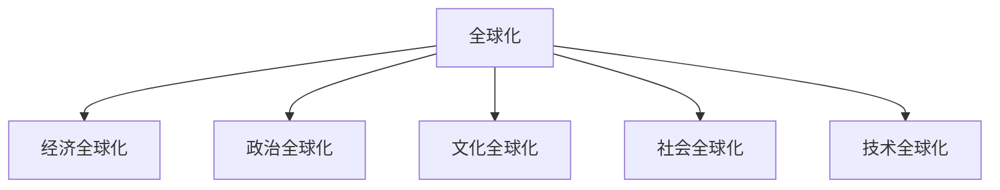
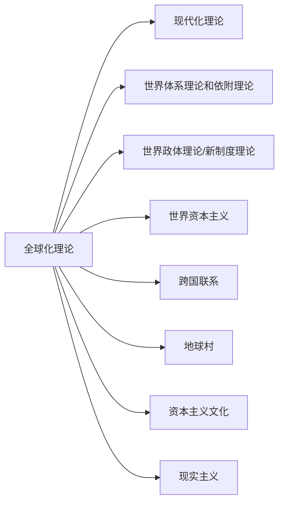

# 全球化与新媒体科技·其一
# 全球化

## 定义
- 全球化不是一个具体的事物或单一的理念：它是**一系列影响整个世界的经济和文化进程**——但并**不平等**。
- 它描述的是**国际贸易**和**文化交流**急剧增加*给社会和世界经济带来的变化*。
- 更广义地说，它指的是全球**行动者**（无论是政治、经济还是其他方面的行动者）之间的全面融合以及由此产生的*相互依存关系的增强*。

> 全球化是全世界人民、公司和政府之间的**互动和融合过程**。自 18 世纪以来，由于交通和通信技术的进步，全球化进程不断加快。全球互动的增加导致了*国际贸易的增长以及思想、信仰和文化的交流*。全球化主要是一个与社会和文化相关的互动和融合的经济过程。然而，**争端和外交**也是全球化历史和现代全球化的重要组成部分。

### 经济全球化
- **国际贸易**增加
- **外国直接投资**增加
- 国家主权和国界的削弱
- **全球金融体系**的发展
- 跨国公司控制的世界经济份额增加
- 世贸组织、世界卫生组织、世界知识产权组织、国际货币基金组织等**国际组织的作用增强**
- **跨国公司外包**等经济行为增多

### 文化全球化
- 扩大国际文化交流
- **多元文化**的传播，个人更容易接触到**文化多样性**，例如通过*好莱坞和宝莱坞电影的出口*。
- 通过杂交甚至同化**减少多样性**。最突出的表现形式是**西化**，但文化的**中国化**也在发生。
- 更多的**国际旅行**
- **移民增加**，包括非法移民
- 全球电信基础设施的发展和跨境数据流量的增加
- 全球适用的标准数量增加，如**版权法和专利法**
- 一套**普世价值观**的形成或发展
- 有人认为，甚至**恐怖主义**也经历了全球化

# 新媒体
## 定义
- 整合与互动
将艺术形式与技术相结合，形成一种混合的表现形式，用户能够直接操纵和影响自己对媒体的体验，并通过媒体与他人交流。
- 超媒体
将独立的媒体元素相互连接起来，形成个人联想的痕迹。
- 沉浸
进入模拟或暗示的三维环境的体验。
- 叙事性
源自上述概念的审美和形式策略，产生非线性的故事形式和媒体表现形式。
- 离散和数字表示法
不同大小的元素被综合在一起，但它们在很大程度上保留了原有的特质。此外，所有元素都可以用数学函数来描述。
- 自动化、可变性和独创性
上述因素允许在创作过程中实现不同程度的自动化。这样，就没有必要以固定的最终形式来创造物品，从而重新定义了原创性和真实性的概念。

# 全球化理论

> 在旧范式中，国家是全球市场的主要行为者，国家主权是领土、民族或文化特性的基体。

# 媒体全球化

**在全球范围内**生产、发行和消费媒体产品，促进跨文化的思想交流和传播。
Lyons (2005) 认为，**跨国公司**是媒体全球化的**主要载体**，这些公司控制着全球大众媒体的内容和发行。从谁控制着哪些媒体渠道的角度看，随着企业集团规模越来越大，独立的新闻来源确实越来越少。

